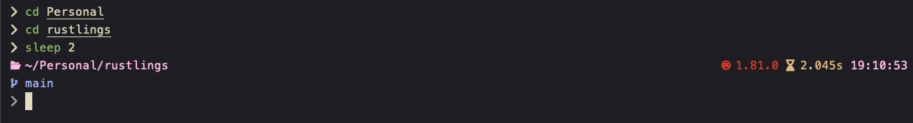

# omp-zen-catppuccin

A custom theme for oh-my-posh based on the catppuccin color scheme.

Provides:
- file path
- shows git directory status
- time of the day
- execution time of the last command (if >1s)
- python env (if .py files present)
- rust version (if .rs files present)
- go version (if .go files present)

